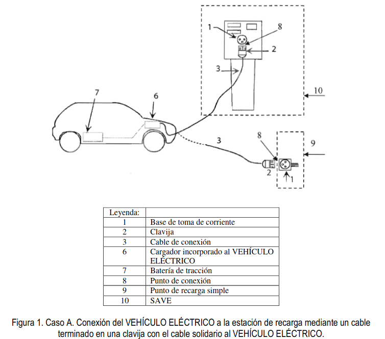
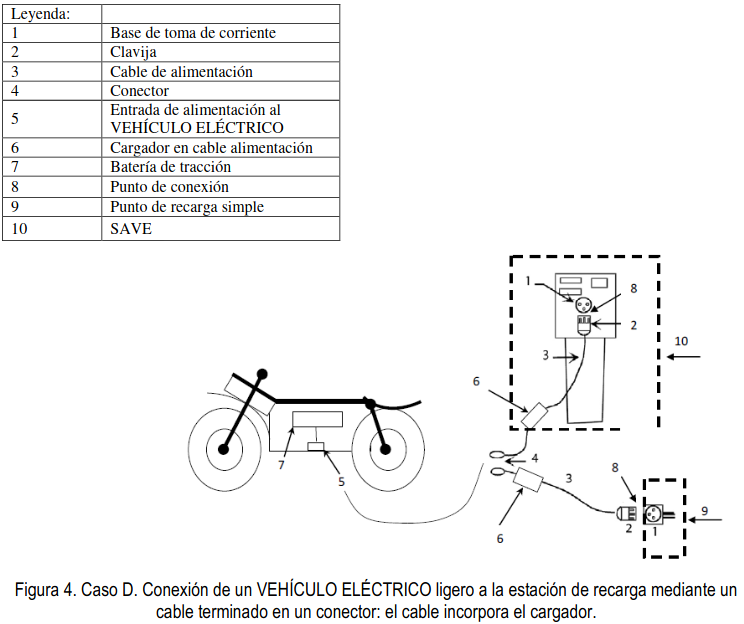

## TÉRMINOS Y DEFINICIONES.

A los efectos de esta instrucción se entenderá por: 

??? Warning "Gestor de cargas"
    Sociedades  mercantiles  que,  siendo  consumidores,  están  habilitados  para  la  reventa  de  energía  eléctrica  para servicios  de  recarga  energética.  Los  gestores  de  carga  del  sistema  son  los únicos  sujetos  con  carácter  de  cliente mayorista en los términos previstos en la normativa comunitaria de aplicación.(Definición según el artículo 6 de la ley 24/2013 del Sector eléctrico).

??? "Circuito de recarga colectivo"

    Circuito  interior  de  la  instalación  receptora  que  partiendo  de  una  centralización  de  contadores  o  de  un  cuadro  de mando y protección, está previsto para alimentar dos o más estaciones de recarga del VEHÍCULO ELÉCTRICO.

??? "«Circuito de recarga individual»."

    Circuito  interior  de  la instalación  receptora  que  partiendo  de  la  centralización  de  contadores  está  previsto  para alimentar una estación de recarga del VEHÍCULO ELÉCTRICO, o circuito de una vivienda que partiendo del cuadro general  de  mando  y  protección  está  destinado  a  alimentaruna  estación  de  recarga  del  VEHÍCULO  ELÉCTRICO, (circuito C13). 
??? "Contador eléctrico principal"

    Contador de energía eléctrica destinado a la medida de energía consumida por una o varias estaciones de recarga. Estos  contadores  cumplirán  con  la  reglamentación  de  metrología  legal  aplicable  y  con  el  reglamento  unificado  de puntos de medida.

    ??? Warning guia
        Los contratos  de  acceso  a  la red  se  realizan siempre  sobre  un contador principal.  Para  los  garajes  en  régimen  de condominio,si  se  utilizanlos  esquemas  colectivos  (1a,1b,  1c  y  4b)  el  titular  del  contrato será la  comunidad  de vecinos y si  se  utilizan  losesquemas  individuales  (2,  3a y 3b)  cada  vecino  individual.  Las  empresas  distribuidoras son las encargadas de la lectura de estos contadores, pero no de los contadores secundarios. 

??? "Contador secundario"

    Sistema  de  medida  individual  asociado  a  una  estación  de  recarga,  que  permite  la  repercusión  de  los  costes  y  la gestión  de  los  consumos.  Estos  sistemas  de  medida  individuales  cumplirán  la  reglamentación  de  metrología  legal aplicable, pero no están sujetos al reglamento unificado de puntos de medida al no tratarse de puntos frontera del sistema eléctrico.

    ??? Warning guia
        La reglamentación de metrología aplicable es la siguiente: 

        * RD  244/2016  para  contadores  de  activa  de  clases  A,  B,  y  C  para  uso  residencial,  comercial  o  de  industria ligera, en la fase de evaluación de la conformidad. 
        * ITC3022/2007  para  los  contadores  estáticos  combinados  activa,  clases  A,  B  y  C  y  reactiva  de  clases2  y  3 hasta  15 kW con  discriminación  horaria y  telegestión  hasta  una  potencia  de  15  kW en activa  en  las  fases  de evaluación de la conformidad, verificación después de reparación o modificación y de verificación periódica. 
        * ITC 3747 para contadores estáticos de activa de clases A, B, y C para uso residencial, comercial o de industria ligera, en las fases de verificación después de reparación o modificación y de verificación periódica. 

          A  los  contadores  secundarios  no  les  resultan  aplicables  los  requisitos  de  telegestión,  ya  que  las  empresas distribuidoras no son las encargadas de su lectura.

??? "Estación de movilidad eléctrica"

    Infraestructura de recarga que cuenta con, al menos, 2 estaciones de recarga, que permitan la recarga simultánea de  vehículo  eléctrico  con  categoría  hasta  M1  (Vehículo  eléctrico  de  ocho  plazas  como  máximo -excluida  la  del conductor-diseñados y fabricados para el transporte de pasajeros) y N1 (Vehículo eléctrico cuya masa máxima no supere las 3,5 toneladas diseñados y fabricados para el transporte de mercancías), según la Directiva 2007/46/CE. Ha de posibilitar la recarga en corriente alterna (monofásica o trifásica) o en corriente continua

??? "Estación de recarga"

    Conjunto de elementos necesarios para efectuar la conexión del VEHÍCULO ELÉCTRICO a la instalación eléctrica fija necesaria para su recarga. Las estaciones de recarga se clasifican como: 

    1. Punto de recarga simple, compuesto por las protecciones necesarias, una o varias bases de toma de corriente no específicas para el vehículo eléctrico y, en su caso, la envolvente.
    2. Punto de recarga tipo SAVE (Sistema de alimentación específico del vehículo eléctrico)

??? "Función de control piloto"

    Cualquier medio, yasea electrónico o mecánico, que asegure que se satisfacen las condiciones relacionadas con la seguridad y con la transmisión de datos requeridas según el modo recarga utilizado.

??? "Infraestructura de recarga de vehículos eléctricos (IVEHÍCULO ELÉCTRICO)"
    Conjunto de dispositivos físicos y lógicos, destinados a la recarga de vehículos eléctricos que cumplan los requisitos de  seguridad  y  disponibilidad  previstos  para  cada  caso,  con  capacidad  para  prestar  servicio  de  recarga  de  forma 
    completa  e  integral.  Una  IVEHÍCULO  ELÉCTRICO  incluye  las  estaciones  de  recarga,  el  sistema  de  control, canalizaciones eléctricas, los cuadros eléctricos de mando y protección y los equipos de medida, cuando éstos sean exclusivos para la recarga del vehículo eléctrico. 

??? "Modo decarga 1"

    Conexión  del  vehículo  eléctrico  a  la  red  de  alimentación  de  corriente  alterna  mediante  tomas  de  corriente normalizadas, con una intensidad no superior a los ==16A== y tensión asignada en el lado de la alimentación no superior a  250V  de  corriente  alterna  en  monofásico  o  480V  de  corriente  alterna  en  trifásico  y  utilizando  los  conductores activos y de protección.

??? "Modo de carga 2"

    Conexión  del  vehículo  eléctrico  a  la  red  de  alimentación  de  corriente  alterna  no  excediendo  de  ==32A==  y  250V  en corriente alterna monofásica o 480V en trifásico, utilizando tomas de corriente normalizadas monofásicas o trifásicas y usando los conductores activos y de protección junto con una función de control piloto y un sistema de protección para  las  personas,  contra  el  choque  eléctrico  (dispositivo  de  corriente  diferencial),  entre  el  vehículo  eléctrico  y  la clavija o como parte de la caja de control situada en el cable.

??? "Modo de carga 3"
    Conexión  directa  del  vehículo  eléctrico  a  la  red  de  alimentación  de corriente  alterna  usando  un  SAVE,  dónde  la función de control piloto se amplía al sistema de control del SAVE, estando éste conectado permanentemente a la instalación de alimentación fija.

??? "Modo de carga 4"
    Conexión  indirecta  del  vehículo  eléctrico  a  lared  de  alimentación  de  corriente  alterna  usando  un  SAVE  que incorpora un cargador externo en que la función de control piloto se extiende al equipo conectado permanentemente a la instalación de alimentación fija

??? "Punto de conexión"
    Punto en el que el vehículo eléctrico se conecta a la instalación eléctrica fija necesaria para su recarga, ya sea a una toma de corriente o a un conector. 

??? "Sistema de alimentación específico de vehículo eléctrico (SAVE)"

    Conjunto  de  equipos  montados  con  el  fin  de  suministrar  energía  eléctrica  para  la  recarga  de  un  VEHÍCULO ELÉCTRICO,  incluyendo  protecciones  de  la  estación  de  recarga,  el  cable  de  conexión,  (con  conductores  de  fase, neutro y protección) y la base de toma de corriente o el conector. Este sistema permitirá en su caso la comunicación entre el VEHÍCULO ELÉCTRICO y la instalación fija. En el modo de carga 4 el SAVE incluye también un convertidor alterna-continua.

    Nota: las definiciones de la función de control piloto, de los modos de carga y del sistema de alimentación específico del vehículo eléctrico (SAVE) están basadas en las normas internacionales aplicables.

??? "Sistema de protección de la línea general de alimentación (SPL)"

    Sistema de protección de la línea general de alimentación contra sobrecargas, que evita el fallo de suministro para el conjunto del edificio debido a la actuación de los fusibles de la caja general de protección, mediante la disminución momentánea  de  la  potencia  destinada  a  la  recarga  del  VEHÍCULO  ELÉCTRICO.  Este  sistema  puede  actuar desconectando  cargas,  o  regulando  la  intensidad  de  recarga  cuando  se  utilicen  los  modos  3  o  4.La  orden  de desconexión y reconexión podrá actuar sobre un contactor o sistema equivalente. 

    ??? Warning guia

        Con  posterioridad  a  la  publicación  del  RD  1053/2014  que  aprueba  la  ITC-BT  52 se  ha  aprobado  la  Especificación [UNE  0048](../assets/000000NUEA167_ES.pdf)  "  Infraestructura  para  la  recarga  de  vehículos  eléctricos.  Sistema  de  protección  de  la  línea  general  de alimentación  (SPL)" que  facilita  directrices  e  información  con  respecto  de  las  funcionalidades  y  requisitos  de seguridad mínimos de un SPL y es aplicable a todas aquellas soluciones que pretenden realizar la función de SPL. Un SPL puede presentarse como un producto único, un conjunto de productos y medidas, soluciones de hardware osoftware o sistemas domóticos oinmóticos

??? "Vehículo eléctrico (VEHÍCULO ELÉCTRICO)"
    Vehículo  eléctrico  cuya  energía  de  propulsión  procede,  total  o  parcialmente,  de  la  electricidad  de  sus  baterías utilizando para su recarga la energía de una fuente exterior al vehículo eléctrico, por ejemplo, la red eléctrica

??? "Tipos de conexión entre la estación de recarga y el VEHÍCULO ELÉCTRICO"
    La conexión entre la estación de recarga y el VEHÍCULO ELÉCTRICO se podrá realizar según los casos A, B y C descritos en las figuras 1, 2 y 3. Nótese que las figuras 1, 2 y 3 no presuponen ningún diseño específico.

    === "A"
         

        Caso A1:conexión a un punto de recarga simple mediante una toma de corriente para usos domésticos y análogos.
        Caso A2: conexión a un punto de recarga tipo SAVE.

    === "B"
         

        Caso B1: conexión a un punto de recarga simple mediante una toma de corriente para usos domésticos y análogos.
        Caso B2: conexión a un punto de recarga tipo SAVE.
    === "C"
         

    === "D"
         

