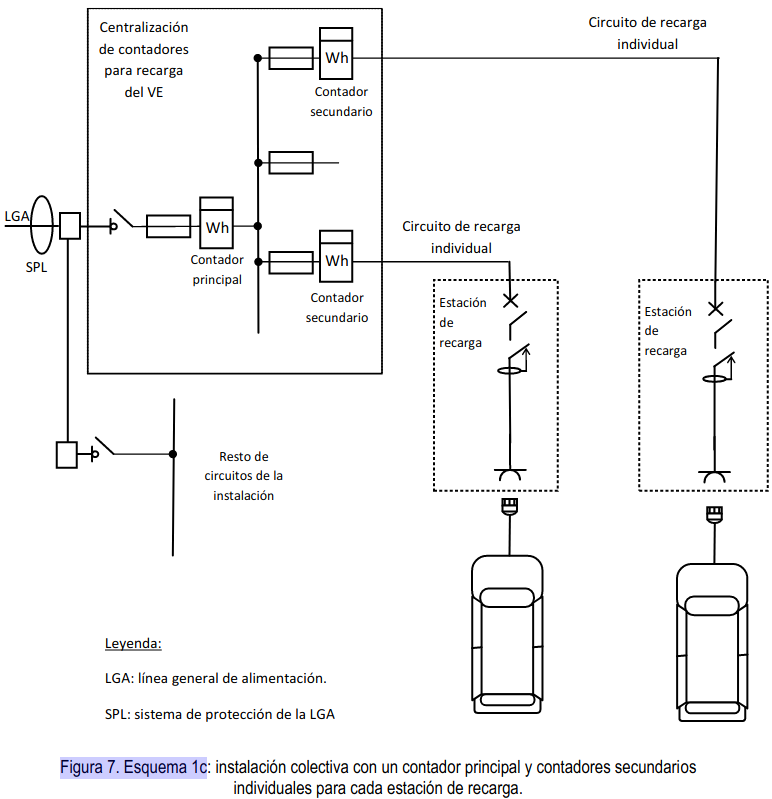
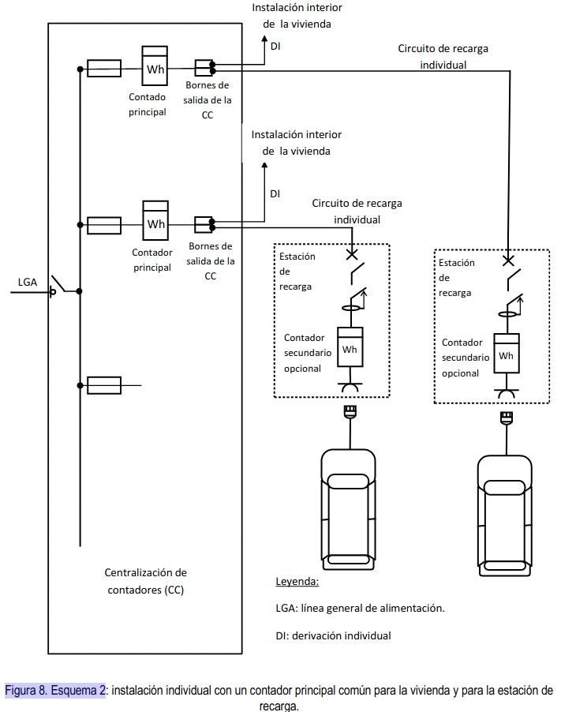
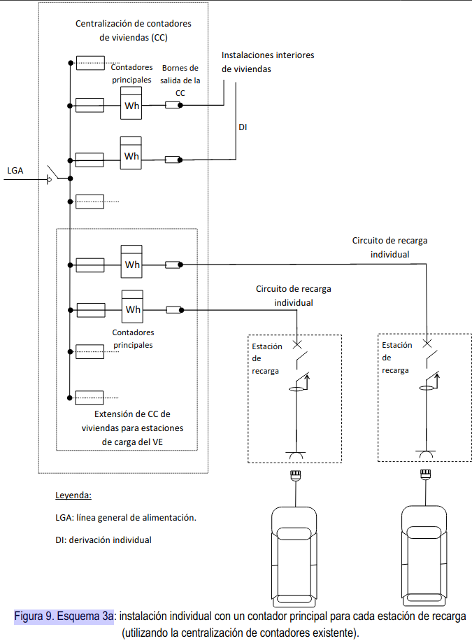
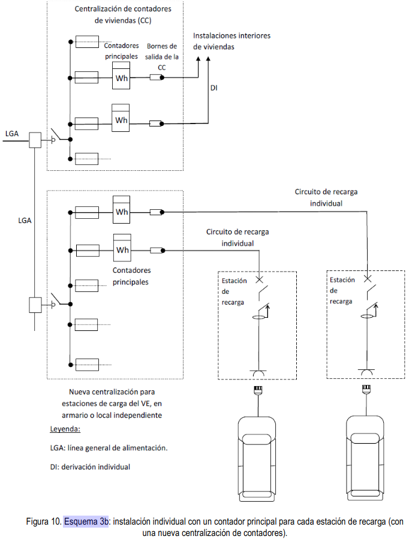
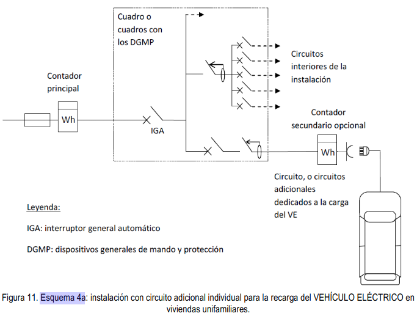
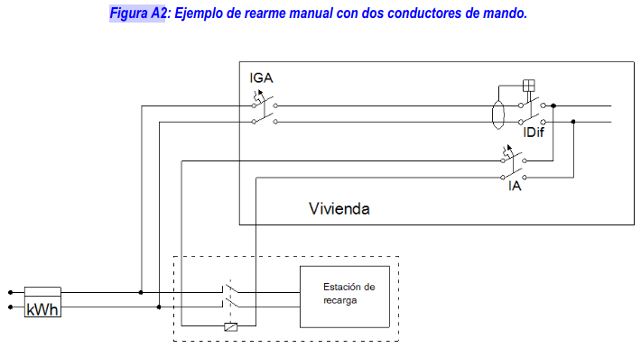
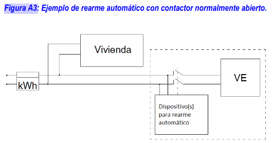
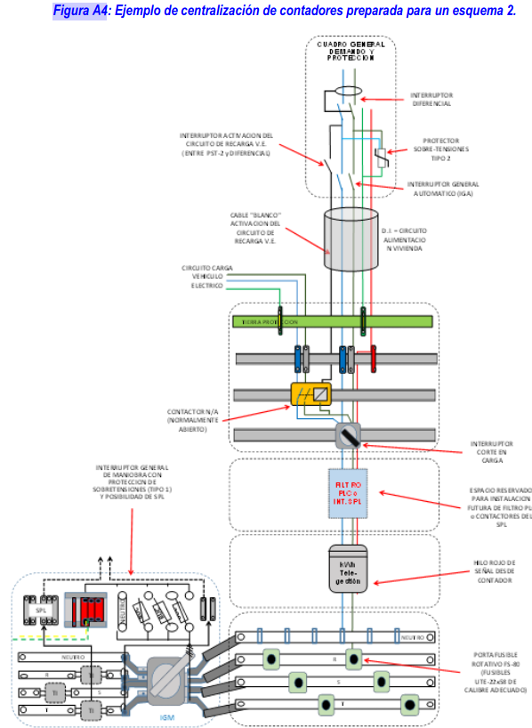

## 3.0 
Las  instalaciones  nuevas  para  la  alimentación  de  las  estaciones  de  recarga,  así  como  la  modificación  de instalaciones ya existentes, que se alimenten de la red de distribución de energía eléctrica, se realizarán según los esquemas  de  conexión  descritos  en este  apartado.  En  cualquier  caso,  antes  de  la  ejecución  de  la  instalación,  el instalador o en su caso el proyectista, deben preparar una documentación técnica en la forma de memoria técnica de  diseño  o  de  proyecto,  según  proceda  en  aplicación  de  la  [(ITC)  BT-04](https://industria.gob.es/Calidad-Industrial/seguridadindustrial/instalacionesindustriales/baja-tension/Documents/bt/guia_bt_04_sep03R1.pdf),  en  la  que  se  indique  el  esquema  de conexión a utilizar. Los posibles esquemas serán los siguientes: 

- 1. Esquema colectivo o troncal con un contador principal en el origen de la instalación.
- 2. Esquema individual con un contador común para la vivienda y laestación de recarga. 
- 3. Esquema individual con un contador para cada estación de recarga. 
- 4. Esquema con circuito o circuitos adicionales para la recarga del VEHÍCULO ELÉCTRICO.

??? Warning  
    Independientemente del esquema utilizado, las instalaciones serán realizadas por un instalador de la categoría que correspondasegún el tipo de instalación, porejemplo, en el caso de proyectarse la instalación en locales con riesgo de incendio o explosión segúnla ITC -BT 29, el instalador deberá ser de la categoría especialista.  

    Debido  al  alto  grado  de  electrónica  de  potencia  a  instalar  y  a  la  gran  variedad  de  fabricantes  de  vehículos  y tecnologías  de  recarga  que  se  pueden  llegar  a  conectar  a  la  red  de  distribución,  así  como  para  facilitar  la  futura instalación  de  sistemas  SPL  que  permitan  incrementar  el  número  de  vehículos  a  recargar  sin  que  sea  preciso modificar  las  instalaciones  de  enlace,  en  las  centralizaciones  de  contadores  de  las  nuevas  instalaciones  se recomienda  reservar espacio  suficiente  para  quelas  empresas  distribuidoras  puedan  instalar en  caso  necesario filtros  PLC,que eviten  queel  ruidoen  el  rango  de  frecuencias  PLC  (procedentes  de  los  distintos  sistemas  de recarga o de los propios vehículos) afectea la telegestión del resto de contadores conectados a la misma red baja tensión  y para  poder instalar igualmenteelementos  para  la  gestión  de  cargas  desde  el  SPLo  en  general, para  el funcionamiento correcto de los distintos esquemas de conexión,tales comocontactores.

    Con tal fin, las empresas distribuidoras de energía eléctrica podrán disponer de especificaciones particulares donde establezcan  las  características  sobre  la  construcción  y  montaje  de  las  centralizaciones  de  contadores  preparadas para   la   conexión   del   vehículo   eléctrico.   Según   se   establece   en   el   artículo   14   del   RD   842/2002   dichas especificaciones deberán ser aprobadas por la administración competente.

=== "1a"
    

=== "1b"
    

=== "1c"
    

=== "2"
    

=== "3a"
    

=== "3b"
    

=== "4a"
    

    ??? Warning 

        Este esquema 4a también se puede utilizar eninstalaciones para la recarga de vehículos eléctricos en edificios o conjuntos inmobiliarios en régimen de propiedad horizontal según lo establecido en el apartado3.2 de esta ITC-BT-52, siempre que la infraestructura común del edificio esté preparada para albergar este tipo de instalación. Su uso  generalizado  en  garajes  en  régimen  de  propiedad  horizontal  supondría  grandes  caídas  de  tensión  y  la necesidad de disponer de patinillos para las derivaciones individuales de grandes dimensiones, de forma que se recomienda su utilización solo en los siguientes casos:

        - Viviendas unifamiliares
        - Fincas de cualquier tipo con un único suministro
  
        Con  el  objetivo  de  mantener el    nivel  de  seguridad,  cuando  con  motivo  de  la  instalaciónde  los  nuevoscircuitos para  la  recarga  de  vehículos  eléctricos se  realiceuna modificación  en  la  instalación  interior  de lavivienda  (por ejemplo  en  el  cuadro  de  mando  y  protección),  se  recomienda  realizar  una  revisión  de  la  instalación  existente, según la UNE 202008 IN.

=== "4b"
    

    ??? Warning 

        Conforme alo establecido en el apartado 3.2 de esta ITC-BT-52, este esquema 4b se puede utilizar para la recarga de vehículos eléctricos en edificios o conjuntos inmobiliarios en régimen de propiedad horizontal, utilizando el cuadro de  los  servicios  generales  de  los  garajes como  punto  de  partida  delos  circuitos  para  la  recarga del  vehículo eléctrico, y utilizando generalmente circuitos de recarga colectivos.

        Si en este esquema 4 b o en cualquier otro interviene un gestor de cargas cabe recordar que en aplicación del RD 647/2011 tendrán que registrar en cada una de sus instalaciones los consumos destinados a la recarga de vehículos eléctricos de forma diferenciada a los consumos que puedan producirse para otros usos. 

        Con  el objetivo  de  mantener el    nivel  de  seguridad,  cuando  con  motivo  de  la  instalación  de  los  nuevos  circuitos para la recarga de vehículos eléctricos se realiceuna modificación en la instalación eléctricade los aparcamientosse  recomienda  realizar  una  revisión  de  la  instalaciónexistente,  según  la parte  aplicable  de  laserie  de  normasUNE 202009IN.

Para la selección entre los esquemas 1a y 1b, se aplicarán los siguientes criterios de prioridad, en primer lugar se utilizarán los módulos de reserva de la centralización existente (esquema 1a), si ello no fuera suficiente se ampliará la centralización  existente  utilizando  también  el esquema  1a,  en  último caso y  por  falta de  espacio, se  dispondrán una o varias centralizaciones nuevas en armarios o locales (esquema 1b).

??? Warning 
    Para la selección entre los esquemas 1a y 1b se tendrá en cuenta que la centralización de contadores disponga de espacio suficiente la instalación de filtros PLC que bloqueen el ruido en el rango de frecuencias PLC, así como para loselementos necesarios para la gestión de cargas desde el SPL o para el funcionamiento correcto de los distintos esquemas de conexión, tales como contactores.

La  protección  de  los  circuitos  de  recarga  se  puede  realizar  con  fusibles  o  con  interruptores  automáticos.  La centralización  de  contadores  para  recarga  del  VEHÍCULO  ELÉCTRICO  puede  formar  parte  de  la  centralización existente o disponerse en una o varias centralizaciones nuevas en armarios o locales.

??? Warning 

    Para la instalación de los circuitos de recarga colectivos según los esquemas 1a, 1b, 1c, o 4b, se utilizarán cajas de derivación de las que partirán las derivacionesque alimentan a cada estación de recarga. Estas cajas de derivación serán responsabilidad de la comunidad de vecinos ya que en general afectarán a varios vecinos. A continuación,se recomiendan algunas características deestas cajas. 

    - Se recomienda su montaje en un paramento vertical (columna o pared), a una alturasuperior a 1,8 metros sobre la cota del suelo del garaje.
    - Cada caja debe tener la posibilidad de conectar 3 o 6 derivaciones a estaciones de carga (múltiplos de tres para facilitar el equilibrado de cargas). 
    - En  instalaciones  nuevas  las cajasdebeninstalarse  a  lo  largo  de  todo su  recorrido  de  forma  que  ninguna plaza de garaje quede a más de 20 metros de una caja. 
    - Lascajas  podrán  albergar  pequeños  interruptores  automáticos  cuando  sean  necesarios  para  proteger  la derivación frente a cortocircuitos. 
    - Las cajas dispondrán de un sistema de cierre a fin de evitar manipulaciones indebidas de sus conexiones. 

Para  el  esquema  2  en  el  proyecto  o  memoria  técnica  de  diseño  se  justificará  que  el  fusible  de  la  centralización protege contra cortocircuitos tanto a la derivación individual, como al circuito de recarga individual, en especial para la intensidad mínima decortocircuito, incrementando la sección obtenida por aplicación de los criterios de caída de tensión y de protección contra sobrecargas para este circuito, si fuera necesario. La función de control de potencia contratada por el cliente será realizada por el contador principal, sin necesidad de instalar un ICP independiente. En caso de actuación de la función de control de potencia, su rearme se realizará directamente desde la vivienda.

??? Warning 

    La  función  de  control  de  potencia  contratada  por  el  cliente  será  realizada  por  el  contador  principal  para  potencias inferiores a 15 kW, sin necesidad en este caso de instalar un ICP independiente.

    El citado rearme puede conseguirse mediante diversas soluciones, por ejemplo: 

    - Soluciones que requieren la utilización de uno o dos conductoresde mandodesde la vivienda hasta un contactorinstalado  en la  centralización  de  contadores, en el  circuito  de  recarga  individual  o  en  la  propia  estación  de recarga.  Como  ejemplos  de  tales  soluciones  se  incluyen  las  figuras  A1  y  A2.Para  el  hilo  de  mando  se recomienda color rojo y una sección mínima de 1,5 mm2. El contactor se podrá ubicar en la propia estación de carga,  o  en  la  centralización  de  contadores  justo  en  el  origen  del  circuito  de  recarga.  Si  se  ubica  en  la centralización  de contadores  la  ventaja  es  que  la  longitud  del  hilo  de  mando  será  menor,  aunque  para instalaciones existentes y por falta de espacio puede ser más sencillo ubicarlo en la estación de carga.
    - Soluciones  queutilizan  dispositivos  adicionales  para  el  rearme  del  contactor  yno  requieren  de  conductores auxiliares desde la vivienda hasta elcontactor.Dichos dispositivos pueden estar instalados enla centralización de  contadores,  enel  circuito  de  recarga  individual  o  en  la  propia  estación  de  recarga.  Como  ejemplo  de  tales soluciones  se  incluye  la  figura  A3.Una  vez  interrumpido  el  circuito  de  recarga  el  contador  debe  apreciar  una impedancia infinita que permita su rearme desde la vivienda. 
    - Cualquier otro método que tecnológicamente pueda realizar esta función de rearme. 

    A  modo  de  ejemplo  en  la  figura  A4  se  presenta  un  ejemplo  de  centralización  de  contadores  preparada  para  el esquema  2,  conun  contador  principal  común  para  la  vivienda  y  para  la  estación  de  recarga,  que  permite  la conexión o desconexión de la recarga del vehículo eléctrico desde la vivienda, así como el rearme de la función de control de potencia también desde la vivienda, para lo cual se utiliza el hilo de mando ya descrito en la figura A1.

    === "A1"
        

    === "A2"
        

    === "A3"
        

    === "A4"
        

    Con  el  objetivo  de  mantener  el nivel  de  seguridad,  cuando  con  motivo  de  la  instalación  de  los nuevoscircuitos para  la  recarga  de  vehículos  eléctricos  se  realiceuna  modificación  en  la  instalación  interior  de  la  vivienda  (por ejemplo,en  el  cuadro  de  mando  y  protección),  se  recomienda  realizar  una  revisión  de  la  instalación  existente, según la UNE 202008 IN.

Para la selección entre los esquemas 3a y 3b, se aplicarán los siguientes criterios de prioridad, en primer lugar se utilizarán los módulos de reserva de la centralización existente (esquema 3a), si ello no fuera suficiente se ampliará lacentralización  existente  utilizando  también  el esquema  3a,  en  último caso y  por falta de  espacio, se  dispondrán una o varias centralizaciones nuevas en armarios o locales (esquema 3b).

Los esquemas de instalación descritos en este apartado no resultan aplicables para la conexión de las estaciones de  recarga  que  se  alimenten  mediante  una  red  independiente  de  la  red  de  distribución  de  corriente  alterna usualmente utilizada, por ejemplo, mediante una red de corriente continua o corriente alterna ferroviaria, o mediante un fuente de energía de origen renovable con posible almacenamiento de energía, en cuyo caso el diseñador de la instalación especificará el esquema eléctrico a utilizar.
Nótese  que  las  figuras  5  a12  son  solamente  ejemplos  ilustrativos  de  los  distintos  esquemas  de  instalaciones  de recarga de vehículos eléctricos y que no contienen todos los elementos de la instalación.

## 3.1 Instalación en aparcamientos de viviendas unifamiliares.

En  las  viviendas unifamiliares  nuevas  que  dispongan  de  aparcamiento  o  zona  prevista  para  poder  albergar  un vehículo  eléctrico  se  instalará  un  circuito  exclusivo  para  la  recarga  de  VEHÍCULO  ELÉCTRICO.  Este  circuito  se denominará circuito C13, según la nomenclatura de la (ITC) BT-25 y seguirá el esquema de instalación 4a.

??? Warning
    En todas  las viviendas  unifamiliares  nuevas  el  circuito  C13  debe  quedar  totalmente  instalando  incluyendo  los sistemas de canalización, los cables, las protecciones y el punto de recarga.
    En todas  las viviendas  unifamiliares  nuevas  el  circuito  C13  debe  quedar  totalmente  instalando  incluyendo  los sistemas de canalización, los cables, las protecciones y el punto de recarga.

Las  instalaciones  existentes  en  las  que  se  desee  instalar  una  estación  de  recarga  se  ajustarán  también  a  lo establecido en este apartado

La alimentación de este circuito podrá ser monofásica o trifásica y la potencia instalada responderá generalmente a uno de los escalones de la tabla 1, según prevea el proyectista de la instalación. No obstante, el proyectista podrá justificar una potenciamayor, en función de la previsión de potencia por estación de recarga o del número de plazas construidas para la vivienda unifamiliar, en cuyo caso el circuito y sus protecciones se dimensionarán acorde con la potencia prevista.

Para evitar desequilibrios en la red eléctrica los circuitos C13 monofásicos no dispondrán de una potencia instalada superior a los 9200 W.

Cuando en un circuito trifásico se conecten estaciones monofásicas, éstas se repartirán de la forma más equilibrada posible entre las tres fases. El número máximo de estaciones de recarga de la tabla 1 por cada circuito derecarga trifásico  se  ha  calculado  suponiendo  estaciones  monofásicas  de  una  potencia  unitaria  de  3680  W.  El  proyectista podrá  ampliar  o  reducir  el  número  máximo  si  justifica  una  potencia  instalada  por  estación  de  recarga  inferior  o superior respectivamente.

Las bases de toma de corriente o conectores instalados en la estación de recarga y sus interruptores automáticos de protección deberán ser conformes con alguna de las opciones indicadas en el apartado 5.4.

## 3.2  Instalación  en  aparcamientos  o  estacionamientos  colectivos  en  edificios  o  conjuntos  inmobiliarios  en régimen de propiedad horizontal

Las instalaciones eléctricas para la recarga de vehículos eléctricos ubicadas en aparcamientos o estacionamientos colectivos  en  edificios  o  conjuntos inmobiliarios  en  régimen  de  propiedad  horizontal  seguirán  cualquiera  de  los esquemas  descritos  anteriormente.  En  un  mismo  edificio  se  podrán  utilizar  esquemas  distintos  siempre  que  se cumplan todos los requisitos establecidos en esta (ITC) BT-52.

??? Warning
    En edificios existentes que carezcan de instalaciones para recarga de vehículos, cuando sea necesario realizar las instalaciones para la recarga del primer vehículo, se recomienda que el o los vecinos propietarios de los vehículos a recargar y la propia comunidad de vecinos lleguen a un acuerdo en relación al esquema o esquemas de conexión a implementar en el edificio, sin que la decisión individual de una de las dos partes afecte a la otra, puesto que cada una debería asumir los costes correspondientes a la modificación o construcción de las instalaciones de las que sea titular.

En  el  esquema  4a,  el  circuito  de  recarga  seguirá  las  condiciones  de  instalación  descritas  en  la  (ITC)  BT-15, utilizando cables y sistemas de conducción de los mismos tipos y características que para una derivación individual; la  sección  del  cable  se  calculará  conforme  a  los  requisitos  generales  del  apartado  5  de  esta  ITC,  no  siendo necesario  prever  una  ampliación  de  la  sección  de  los  cables  para  determinar  el  diámetro  o  las  dimensiones transversales del sistema de conducción a utilizar.     

??? Warning

    Para  instalaciones  existentes  en  garajes  en  régimen  de  propiedad  horizontalen  las  que  se  utilice  el  esquema  4a para la recarga del vehículo eléctrico se tendrán en cuenta los siguientes aspectos: 

    - Los cables del  circuito de  recargase podrán instalar por  el interior del  mismo  Sistema  de  Conducción  de Cables  (SCC)  de  la  Derivación  Individual  (DI)  siempre  que  haya  espacio  disponible  para  ello  de  acuerdo con las reglas de la ITC-BT-21. En este caso los conductores del circuito de recargautilizarán la reservade espacio vacíodel SCCprescrito en la ITC-BT-15.
    - En caso que no hubiera suficiente espacio disponibleen el interior del SCC de la DI para poder pasar por su interior los conductores del circuito de recarga se podrá utilizar el tubo o conducción de reserva para DIs siempre  que  existala  canalizacióny tengaespacio  disponible  para  ello,de  acuerdo  con  lasreglas  de  la ITC-BT 21.
    - En caso que no fuera posible instalar el cable del circuitode recargaen el interior del SCC de la DI o por la conducciónde reserva para DIs, será posible instalar dicho cable bien en el interior de un SCC adicional o directamente  en  la  canaladura  de  obra delas  DIs  siempre  y  cuando  haya  espacio disponiblepara  ello.Cuando el circuito de recarga se instale directamente en la canaladura se utilizará cable multiconductor de 0,6/1 kV , de acuerdo con las reglas de la ITC-BT 21.
    - Por  motivos  de  espacio  y  en  caso  de  que  ninguna  de  las  anteriores  soluciones  sea  posible, se  podrá admitirla instalación de los conductores de circuitosde recarga de distintos suministros porel interior de un mismo  sistema  de  conducción  de  cables  (ya  sea  el  tubo  de  reserva  para  derivaciones  individuales  u  otro SCC instalado adicionalmente)siempre que exista espacio disponible según las reglas de la ITC-BT 21. En tal  caso,  para  asegurar  la  separación  necesaria  entre  suministros,  los  circuitos  C13  deberán  realizarse utilizando cable multiconductor de tensión asignada 0,6/1 kV.

El esquema 4b se utilizará cuando la alimentación de las estaciones de recarga se proyecte como parte integrante o ampliación de la instalación eléctrica que atiende a los servicios generales de los garajes.
Tanto en instalaciones existentes como en instalaciones nuevas, y con objeto de facilitar la utilización del esquema eléctrico seleccionado, los cuadros con las protecciones generales se podrán ubicar en los cuartos habilitados para ello o en zonas comunes.
Las instalaciones en edificios o conjuntos inmobiliarios de nueva construcción se equiparán como mínimo con una preinstalación eléctrica para la recarga de VEHÍCULO ELÉCTRICO, de forma que se facilite la utilización posterior de cualquiera de los posibles esquemas de instalación. Para ello se preverán los siguientes elementos:

- a) Instalación  de  sistemas  de  conducción  de  cables  desde  la  centralización  de  contadores  y  por  las  vías principales   del   aparcamiento   o   estacionamiento  con   objeto   de   poder   alimentar   posteriormente   las estaciones   de   recarga   que   se   puedan   ubicar   en   las   plazas   individuales   del   aparcamiento   o estacionamiento,  mediante  derivaciones  del  sistema  de  conducción  de  cables  de longitud  inferior  a  20  m. Los  sistemas  de  conducción  de  cables  se  dimensionarán  de  forma  que  permitan  la  alimentación  de  al menos el 15% de las plazas  mediante cualquiera de los esquemas posibles de instalación.
- b) La centralización de contadores se dimensionará de acuerdo al esquema eléctrico escogido para la recarga del  VEHÍCULO  ELÉCTRICO  y  según  lo  establecido  en  la  (ITC)  BT-16.  Se  instalará  como  mínimo  un módulo   de   reserva   para   ubicar   un   contador   principal,   y   los   dispositivos   de   protección   contra sobreintensidades asociados al contador, bien sea con fusibles o con interruptor automático.

??? Warning

    Así, pues, dado que el porcentaje citado es un mínimo y en base a la creciente demanda de este tipo de vehículos, sería recomendable realizar la ==preinstalación para el 100% de las plazas==.En relación a las potencias previstas será de aplicación lo indicado en el Anexo 2. 

Cuando  se  realice la  instalación  para el primer  punto  de  conexión  en edificios  existentes,  se deberá  prever,  en su caso, la instalación de los elementos comunes de forma que se adecúe la infraestructura para albergar la instalación de futuros puntos de conexión.

??? Warning

    e recomienda que los elementos comunes a instalar tales como las canalizaciones y los módulos de reserva en la centralización  de  contadores  sigan  las  siguientes  pautas,  no  siendo  obligatorio  que  la  preinstalación  incluya  los cables de los circuitos de alimentación del vehículo eléctrico,ni las estaciones de recarga. 

    - Cuando  en edificios  existentes se  realice  la  instalación  del  primer  punto  de recarga,  se dimensionará  la canalizaciónpara  albergar  la  instalación  de  futuros  puntos  de recargaen  la  zona  de  influencia  delpuntoa instalar. El criterio anterior deberá aplicarse también cada vez que se realice la instalación de un nuevo punto de recarga. En el Anexo 1, aplicable a edificios o conjuntos inmobiliarios en régimen de propiedad horizontal, se presenta un ejemplo de cómo dimensionarestas canalizaciones. 

    - Cuando en  edificios  existentes se  realice  la  instalación  de  un  punto  de  recarga  utilizando  un  esquema  que precise deun contador principal adicional (esquemas 1 o 3) y por falta de espacio fuera necesario realizar una nueva centralización de contadores, generalmente en armario, ésta se dimensionará con al menos un módulo de reserva para instalar el contador asociado con un futuro punto de recarga.

Las bases de toma de corriente o conectores instalados en la estación de recarga y sus interruptores automáticos de protección deberán ser conformes con alguna de las opciones indicadas en el apartado 5.4.

## 3.3. Otras instalaciones de recarga.

Las instalaciones eléctricas para la recarga de vehículos eléctricos alimentadas de la red de distribución de energía eléctrica, distintas de las descritas en 3.1 y 3.2 seguirán los esquemas 1a, 1b, 1c, ó 4b descritos anteriormente. 

Las bases de toma de corriente o conectores instalados en la estación de recarga y sus interruptores automáticos de protección deberán ser conformes con alguna de las opciones indicadas en el apartado 5.4.

### 3.3.1. Estaciones de recarga para autoservicio (uso por personas no adiestradas).
Estas  estaciones  de  recarga,  tales  como  las  ubicadas  en  la  vía  pública,  en  aparcamientos  o  estacionamientos  de flotas   privadas,  cooperativas   o   de   empresa,   para   su  propio   personal   o   asociados   y   en   aparcamientos  o estacionamientos públicos, gratuitos o de pago, de titularidad pública o privada, están destinadas a ser utilizadas por usuarios no familiarizados con los riesgos de la energía eléctrica. 
Este tipo de instalaciones podrán utilizar cualquier modo de carga. 

### 3.3.2.   Estaciones   de   recarga   con   asistencia   para   su   utilización   (uso   por   personas   adiestradas   o cualificadas).

Estas  estaciones  de  recarga,  tales  como  las  ubicadas  en  aparcamientos  para  recarga  de  flotas,  talleres, concesionarios  de  automóviles,  depósitos  municipales  de  vehículo eléctrico,  así  como  otras  estaciones  dedicadas específicamente  a  la  recarga  del  VEHÍCULO  ELÉCTRICO,  están  destinadas  a  ser  utilizadas  o  supervisadas  por usuarios familiarizados con los riesgos de la energía eléctrica,

Este  tipo  de  instalaciones  dispondránpreferentemente  de  los  modos  de  carga  3  o  4,  aunque  también  podrán equiparse  con  estaciones  de  recarga  en  modo  1  ó  2,  cuando  esté  previsto  recargar  vehículos  eléctricos  de  baja potencia tales como bicicletas,  ciclomotores y cuadriciclos. 

## 4. PREVISIÓN DE CARGAS SEGÚN EL ESQUEMA DE LA INSTALACIÓN.

??? Warning

    Para realizar la previsión de cargas en garajes de nueva construcción en régimen de condominiocuando se desee realizar  la  preinstalación  para  un  número  de  las  plazas  elevado,  mayor  que  el  mínimo  reglamentarioy  superior  al 50% del total de plazas de garaje construidas, se podrá seguir lo indicado en el anexo 2 la GUÍA ITC-BT 52.

    Una vez terminada la instalación, y con objeto de conocer fácilmente la máxima potencia a contratar, el certificado de  instalación eléctrica  (CIE)  debería  recoger,  entre  otros  valores,  la  información  actualizada  correspondiente  a  la potencia  máxima  admisible  de  la  totalidad  de  la  instalación  (esto  es,  potencia  máxima  admisible  de  la  instalación aguas abajo del punto frontera entre empresa distribuidora y consumidor).

### 4.1. Esquema colectivo con un contador principal común (esquemas 1a, 1b y 1c).

La instalación del SPL será opcional, en edificios de nueva construcción a criterio del promotor y en instalaciones en edificios   existentes a   criterio   del   titular   del   suministro,   o,   en   su   caso,   de   la   Junta   de   Propietarios.   El dimensionamiento  de  las  instalaciones  de  enlace  y  la  previsión  de  cargas  se  realizará  considerando  un  factor  de simultaneidad de las cargas del VEHÍCULO ELÉCTRICO con el resto de la instalación igual a 0,3 cuando se instale el  SPL  y  de  1,0  cuando  no  se  instale.  Como  entrada  de  información  el  SPL  recibirá  la  medida  de  intensidad  que circula por la LGA.

$P_{edificio}=(P_1+P_2+P_3+P_4)+ 0.3*P_5$ (se instala SPL)
$P_{edificio}=(P_1+P_2+P_3+P_4)+ P_5$ (no se instala SPL)
Donde: 

- $P1$, carga correspondiente al conjunto de viviendas obtenida como - $el$  número de viviendas por el coeficiente de simultaneidad de - $la$  tabla 1 de la (ITC) BT 10. 
- $P2$, carga correspondiente a los servicios generales.  
- $P3$, carga correspondiente a locales comerciales y oficinas.
- $P4$, carga correspondiente a los garajes distintas de la recarga - $de$l  VEHÍCULO ELÉCTRICO.
- $P5$, carga prevista para la recarga del VEHÍCULO ELÉCTRICO.

En el proyecto o memoria técnica de diseño de instalaciones en edificios existentes se incluirá el cálculo del número máximo de estaciones de recarga que se pueden alimentar teniendo en cuenta la potencia disponible en la LGA y considerando  la  suma  de  la  potencia  instalada  en  todas  las  estaciones  de  recarga  con el  factor  de  simultaneidad que corresponda con el resto de la instalación, según se disponga o no del SPL. 

??? Warning
    Laprevisión  de  potenciade  los  puntos  de  recarga  a  instalar  en  aparcamientos  o  estacionamientos  colectivos  en edificios  o  conjuntos  inmobiliarios en  régimen  de  propiedad  horizontalno  será  inferior  a  la  previsión  de  potencia mínima para la instalación de recarga de vehículo eléctrico según el requisito de la ITC-BT-10. 

    $$P_{5 minimo}=0.1*N plazas *3.68 kW$$

    La  previsión  de  potencia  de  los  puntos  de  recarga  a  instalar  en  edificios  de  uso  no  residencial  tales  como  los edificios  de  oficinas  u  otros  de  usos  comerciales  se  calculará  conforme  a  la  disposición  adicional  primera  del  RD 1053/2014 con la siguiente fórmula:

    $$P_{5 minimo}=\frac{N plazas}{40} *3.68 kW$$

    Para poder aplicar el factor 0,3para el cálculo de la previsión de cargas del edificio, es necesario que se instale un SPL en el edificiojunto con las estaciones de recarga.

    Dado que el correcto funcionamiento del SPL condiciona las dimensiones de la instalación de enlace y repercute en su  seguridad, durante  la  instalación  de  sistema se  debe  asegurar  por  parte  del  titular  o  promotor  y  de  los responsables  técnicos  que  intervienen  en  la  instalación  (proyectista  o  instalador  según  el  caso),  que  el  SPL  y  los puntos  de  recarga  instalados  se  comuniquen  correctamente. Una  vez  puesta  en  servicio  la  instalación,  será responsabilidad  del  titular  su  correcto mantenimiento,así  como  del  correcto  funcionamiento  de  las  estaciones  de recarga gestionadas por el SPL.

El  número  de  estaciones  de  recarga  posibles  para  cada  circuito  de  recarga  colectivo  y su  previsión  de  carga  se calcularán,  teniendo  en  cuenta  la  potencia  prevista  de  cada  estación  con  un  factor  de  simultaneidad  entre  las estaciones  de  recarga  igual  a  la  unidad.  No  obstante,  el  número  de  estaciones  por  circuito  de  recarga  colectivo podrá  aumentarse  y  el  factor  de  simultaneidad  entre  ellas  disminuirse  si  se  dispone  de  un  sistema  de  control  que mida la intensidad que pasa por el circuito de recarga colectivo y reduzca la intensidad disponible en las estaciones, evitando las sobrecargas en el circuito de recarga colectivo.

??? Warning

    En caso de existir un sistema de control interno del circuito de recarga colectivoque mida la intensidad que pasa por dicho circuito y que pueda limitar la potencia disponible en las estaciones,la potencia prevista, P5, para un número N de estaciones de recarga,podría reducirse,aunque nunca por debajo delumbral mínimo (P5 mínimo). Si se mantiene la  previsión  de  potencia,  la  instalación  de  este  sistema  de  control permitiríala  instalación  de  puntos  de  recarga adicionales. En todo caso,el sistemaoptimiza el control de las cargas regulando la disponibilidad de potencia para la carga simultánea detodos los vehículos eléctricos. 

### 4.2. Esquema individual (esquemas 2, 3a y 3b).
El dimensionamiento de las instalaciones de enlace y la previsión de cargas se realizará considerando un factor de simultaneidad de las cargas del VEHÍCULO ELÉCTRICO con el resto de cargas de la instalación igual a 1,0.

??? Warning

    El mínimo reglamentario a considerar de la carga prevista para el VE, seráel mismo valor P5, mínimoindicado en el apartado 4.1,según se trate de aparcamientos en régimen de propiedad horizontal o de aparcamientos en edificios de uso no residencial. Para aplicar estemínimose separarála potencia prevista para el VE de la potencia prevista paraotras cargas, tales comolasviviendas. 

    En caso de utilizar el esquema 2:

    - Dado que el circuito de alimentación de la estación de recarga no se alimenta de la derivación individual a la  vivienda,  la  previsión  de  potencia  del  vehículo  eléctrico  no  influye  en  el  dimensionamiento  de  la derivación individual a la vivienda. Por tanto,para el cálculo de la sección de la derivación individual de las viviendas se tendrá en cuenta sólo la previsión de potencia de la propia vivienda sin considerar la potencia para la carga del vehículo eléctrico.

    - Respecto  a  la  previsión  de  potencia  total,la  potencia  prevista  para  la  recarga  del  vehículo  eléctrico se englobará dentro de la de la vivienda (como parte de P1) por lo que la previsión de potencia de la vivienda se incrementará en la potencia prevista para larecarga del vehículo eléctrico

    - No resulta necesario  prever  un  grado  de  electrificación  elevado  para las  viviendas  en  todos  los  casos,  ya que la potencia prevista para el vehículo eléctrico se estima de forma independiente a la de la vivienda.

En los esquemas 3a y 3b, la función de control de potencia contratada para la estación de recarga se realizará con el contador principal, sin necesidad de instalar un ICP externo al contador.

??? Warning

    En  caso  de  utilizar  el  esquema  3,  como  cada  punto  de  recarga de  vehículos  eléctricos  cuenta  con  su  propio suministro individual, la recarga de vehículo eléctrico debe considerarse como una carga adicional a las del resto del edificio e incluirse dentro de P5.

### 4.3. Esquema 4 (esquemas 4a y 4b).
La  previsión  de  cargas  se  realizará  considerando  un  factor  de  simultaneidad  de  las  cargas  del  VEHÍCULO ELÉCTRICO con el resto de circuitos de la instalación igual a 1,0. Para calcular el número de estaciones de recarga en un circuito de recarga colectivo y la simultaneidad entre ellas según el esquema 4b, se aplicará lo indicado en el apartado 4.1.

??? Warning

    Cuando  se  utilice  el  esquema  4a  en  viviendas  unifamiliares  la  previsión  de  cargas  de  la  vivienda  incluirá  el  o  los puntos de recarga del VE, con una previsión mínima de 9200 W por vivienda (nivel de electrificación elevada). 
    
    Cuando se utilicen el esquema 4a o el 4b para aparcamientos colectivos en régimen de propiedad horizontal o para aparcamientos en edificios de uso no residencial se aplicarála previsión de cargas mínima, P5, mínimoindicada en el apartado 4.1. Para aplicar este mínimo se separará la potencia prevista para el VE de la potencia prevista para otras cargas, tales como las viviendasque podrán ser de electrificación básica o elevada.
    En caso de utilizar el esquema 4a, a diferencia del caso en que se utiliza un esquema 2, la potencia correspondiente a la carga del vehículo eléctrico sí influye en el dimensionamiento de la derivación individual a la vivienda. 
    
    En  instalaciones  existentes  con  el  esquema  4a la  potencia  prevista  para  la  recarga  del  vehículo  eléctrico se englobarádentro  de  la  de  la  vivienda  (como  parte  de  P1)  por  lo  que  la  previsión  de  potencia  de  la  vivienda  se incrementará en la potencia prevista para la recarga del vehículo eléctrico con factor de simultaneidad 1. 
    
    En instalaciones existentes con el esquema 4b la potencia prevista para la recarga de vehículo eléctrico se sumará con la previsión de potencia del resto de la instalación también con factor de simultaneidad 1. 
    
    En caso de existir un sistema de control interno del circuito de recarga colectivo que mida la intensidad que pasa por dicho circuito y que pueda limitar la potencia disponible en las estaciones, la potencia instalada en dicho circuito y por tanto la previsión de cargas para dicho circuito se podrá reducir,ya que el sistema controlarála disponibilidad de potencia para la recarga simultánea en todos los puntos

