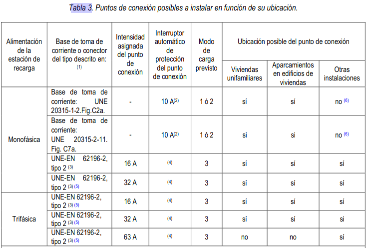

# 5.REQUISITOS GENERALES DE LA INSTALACIÓN

En  los  locales  cerrados  de  edificios  destinados  a  aparcamientos  o  estacionamientos  colectivos  de  uso  público  o privado,  se  podrá  realizar  la  operación  de  recarga  de  baterías  siempre  que  dicha  operación  se  realice  sin desprendimiento de gases durante la recarga y que dichos locales no estén clasificados como locales con riesgo de incendio o explosión según la (ITC) BT 29. En el local donde se realice la recarga del vehículo eléctrico se colocará un  cartel  reflectante  en  el  punto  de  recarga  que  identifique  que  no  está  permitida  la  recarga  de  baterías  con desprendimiento de gases.

??? Warning

    Cuando se pretenda realizar una instalación para la recarga del VE en un garaje existente con ventilación forzada o con  ventilación  natural  ymás  de  5  plazasde  aparcamiento,  el  proyectista  encargado  de  elaborar  el  proyecto  o  el instalador  encargado  de  elaborar  la  memoria  técnica  de  diseño,  revisarán  el  proyecto  original  de  la  instalación eléctrica  del  garaje  para  comprobar  si  el  garaje  está  desclasificado  y  si  se  siguen  cumpliendo  las  condiciones  de ventilación  que  permitieron  esta  desclasificación. En  caso  de  que  no  se  pueda  comprobar  que  el  garaje  está desclasificado se realizará un proyecto de desclasificación según la ITC-BT 29.

Los circuitos de recarga colectivos discurrirán preferentemente por zonas comunes.

Para  los  esquemas  1a,  1b,  1c,  2,  3a  y  3b,  los  contadores  principales  se  ubicarán  en  el  propio  local  o  armario destinado  a  albergar  la  concentración  de  contadores  o,  en  caso  que  no  se  disponga  de  espacio  suficiente,  se habilitará  un  nuevo  local  o  armario  al  efecto  de  acuerdo  con  los  requisitos  de  la  (ITC)  BT-16.  Cuando  se  instalen contadores secundarios, éstos se ubicarán en un armario, en una envolvente o dentro de un SAVE. 

??? Warning

    En  el  esquema  4b,  el  contador  principal,  que  será  el  correspondiente  a  los  servicios  generales  de  la  finca,  debe ubicarse en la centralización de contadores.

Se admitirá que la línea general de alimentación tenga derivaciones de menor sección si se garantiza la protección de dichas derivaciones contra sobreintensidades. Para tal fin, en los esquemas 1b, 1c y 3b, se podrán incluir en la caja de derivación las protecciones necesarias con fusibles o interruptor automático.

??? Warning

    La caja en la que se realice la derivación de la LGA debe estar ubicada en un cuarto o armario de contadores o bien en una zona común. La caja estará cerrada y dispondrá de un sistema de cierre similar al utilizado en los armarios de contadores.

Cuando se instale un circuito de recarga colectivo que alimente a varias estaciones de recarga (según el esquema 1a, ó 1b), cada circuito partirá de un interruptor automático para su protección contra sobrecargas y cortocircuitos. Aguas  arriba  de  cada  interruptor  automático  y  en  el  mismo  cuadro  se  instalará  un  IGA  (interruptor  general automático) para la protección general de todos los circuitos de recarga

En aparcamientos y estacionamientos, el cuadro de mando y protección asociado a las estaciones de recarga estará identificado en relación a la plaza o plazas de aparcamiento asignadas. Los elementos a instalar en dicho cuadro se definen en el apartado 6. 

Los  cuadros  de  mando  y  protección,  o  en  su  caso  los  SAVE  con  protecciones  integradas,  deberán  disponer  de sistemas de cierre a fin de evitar manipulaciones indebidas de los dispositivos de mando y protección.
La  potencia  instalada  en  los  circuitos  de  recarga  colectivos  trifásicos  según  el  esquema  1a,  1b  ó  4b  se  ajustará generalmente  a  uno  de  los  escalones  de  la  tabla  siguiente,  aunque  el  proyectista  podrá  justificar  una  potencia distinta, en cuyo caso el circuito y sus protecciones se dimensionarán acorde con la potencia prevista.

Las estaciones de recarga monofásicas se repartirán de forma equilibrada entre las tres fases del circuito de recarga colectivo. El número máximo de estaciones de recarga por cada circuito de recarga colectivo indicado en la tabla 2, se  ha  calculado  suponiendo  que  las  estaciones  son  monofásicas  y  de  una  potencia  unitaria  de  3680  W.  El proyectista  podrá  ampliar  o  reducir  el  número  de  estaciones  de  recarga  si  justifica  una  potencia  instalada  por estación inferior o superior respectivamente.

La previsión de potencia y las características del circuito de recarga colectivo o individual previsto para el modo de carga 4 se determinarán para cada proyecto en particular.

El  sistema  de  iluminación  en  la  zona  donde  esté  prevista  la  realización  de  la  recarga  garantizará  que  durante  las operaciones  y  maniobras  necesarias  para  el  inicio  y  terminación  de  la  recarga  exista  un  nivel  de  iluminancia horizontal mínima a nivel de suelo de 20 lux para estaciones de recarga de exterior y de 50 lux para estaciones de recarga de interior.

La  caída  de  tensión  máxima  admisible  en  cualquier  circuito  desde  su  origen  hasta  el  punto  de  recarga  no  será superior  al  5%.  Los  conductores  utilizados  serán  generalmente  de  cobre  y  su  sección  no  será  inferior  a  2,5mm2, aunque podrán ser de aluminio en instalaciones distintas de las viviendas o aparcamientos colectivos en edificios de viviendas,  en  cuyo  caso  la  sección  mínima  será  de  4mm2.  Siempre  que  se  utilicen  conductores  de  aluminio,  sus conexiones  deberán  realizarse  utilizando  las  técnicasapropiadas  que eviten  el  deterioro  del conductor  debido  a  la aparición de potenciales peligrosos, originados por pares galvánicos entre metales distintos.

En  instalaciones  para  la  recarga  de  VEHÍCULO  ELÉCTRICO,  que  reúnan  más  de  5  estaciones  de  recarga, por ejemplo en estaciones dedicadas específicamente a la recarga del VEHÍCULO ELÉCTRICO, el proyectista estudiará la necesidad de instalar filtros de corrección de armónicos, con el objeto de garantizar que se mantiene la distorsión armónica  de  la  tensión según  los  límites  característicos  de  la  tensión  suministrada  por  las  redes  generales  de distribución, para que otros usuarios que estén conectados en el mismo punto de la red no se vean perjudicados. 

??? Warning

    En caso necesario, independientemente del número de estaciones de recarga, el proyectista o instalador preverálos elementos de corrección necesarios para evitar perturbaciones o distorsiones que afecten a la red yen particulara las comunicaciones del sistema de telegestión de los contadores, por ejemplo,mediante la instalación de filtros.Con tal  fin,  junto  con  el  contador  principal,  tanto  en  cajas  de  protección  y  medida,  CPM,  como  en  centralizaciones  de contadores, se recomienda reservar un espacio adecuado para que la empresa distribuidora pueda instalar un filtro PLC  que  elimine  el  ruido  en  el  rango  de  frecuencia  PLC  que  pueden  introducir  las  estaciones  de  recarga  o  los propios vehículos y que impiden la telegestión del resto de suministros conectados a la misma red de baja tensión. En instalaciones existentes en las que no haya posibilidad de adecuar la centralización, se podrá utilizar cualquier otra ubicación aguas arriba de la estación de recarga.

El circuito que alimenta el punto de recarga debe ser un circuito dedicado y no debe usarse para alimentar ningún otro equipo eléctrico salvo los consumos auxiliares relacionados con el propio sistema de recarga, entre los que se puede incluir la iluminación de la estación de recarga.

La  instalación  fija  para  la  recarga  del  VEHÍCULO  ELÉCTRICO  deberá contar  con  las  bases  de  toma  de  corriente que corresponda según el modo de carga y ubicación de la estación de recarga conforme al apartado 5.4, de forma que se evite la utilización de prolongadores o adaptadores por parte de los usuarios de los servicios de recarga.

En todos los casos, pero de forma especial en los edificios existentes, el diseñador de la instalación comprobará que no se sobrepasa la intensidad admisible de la línea general de alimentación (o de la derivación individual en caso de viviendas  unifamiliares),  teniendo  en  cuenta  la  potencia  prevista  de  cada  estación  de  recarga  y  el  factor  de simultaneidad que proceda según se indica en el apartado 4. 

La  instalación  para  la  recarga  del  VEHÍCULO  ELÉCTRICO  se  podrá    proyectar  como  una  ampliación  de  la instalación  de  baja  tensión  ya  existente  o  con  una  alimentación  directa  de  la  red  de  distribución  mediante  una instalación de enlace propia independiente de la ya existente. 

Para  toda  instalación  dedicada  a  la  recarga  de  vehículos  eléctricos,  seaplicarán  las  prescripciones  generales siguientes.

## 5.1 Alimentación.

La tensión nominal de las instalaciones eléctricas para la recarga de vehículos eléctricos alimentadas desde la red de distribución será de 230/400 V en corriente alterna para los modos de carga 1, 2 y 3.  Cuando se requiera instalar una  estación  de  recarga  con  alimentación  trifásica,  y  la  tensión  de  alimentación  existente  sea  de  127/220  V,  se procederá a su conversión a trifásica 230/400 V. 

En el modo de carga 4, la tensión de alimentación se refiere a la tensión de entrada del convertidor alterna-continua, y podrá llegar hasta 1000 V en trifásico corriente alterna y 1500 V en corriente continua.

## 5.2 Sistemas de conexión del neutro.
Con  objeto  de  permitir  la  protección  contra  contactos  indirectos  mediante  el  uso  de  dispositivos  de  protección diferencial  en  los  casos  especiales  en  los  que  la  instalación  esté  alimentada  por  un  esquema  TN,  solamente  se utilizará en la forma TN-S.

## 5.3 Canalizaciones.

Las canalizaciones necesarias parala instalación de puntos de recarga deberán cumplir con los requerimientos que se establecen en las diferentes ITC del REBT en función del tipo de local donde se vaya a hacer la instalación (local de pública concurrencia, local de características especiales, etc.)

Los cables desde el SAVE hasta el punto de conexión que formen parte de la instalación fija (ver figura 3, caso C de forma de conexión), deben ser de tensión asignada mínima 450/750 V, con conductor de cobre clase 5 o 6 (aptos para  usos  móviles)y  resistentes  a  todas  las  condiciones  previstas  en  el  lugar  de  la  instalación:  mecánicas  (por ejemplo abrasión e impacto, sacudidas o aplastamiento), ambientales (por ejemplo presencia de aceites, radiación ultravioleta o temperaturas extremas) y de seguridad (por ejemplodeflagración o vandalismo).

Cuando  los  cables  de  alimentación  de  las  estaciones  de  recarga  discurran  por  el  exterior,  estos  serán  de  tensión asignada 0,6/1kV.

## 5.4 Punto de conexión.

El punto de conexión deberá situarse junto a la plaza a alimentar, e instalarse de forma fija en una envolvente. La altura  mínima  de  instalación  de  las  tomas  de  corriente  y  conectores  será  de  0,6m  sobre  el  nivel  del  suelo.  Si  la estación  de  recarga  está  prevista  para  uso  público  la  altura  máxima  será  de  1,2  m  y  en  las  plazas  destinadas  a personas con movilidad reducida, entre los 0,7 y 1,2 m. 

??? Warning

    Se recomienda que la altura mínima de las estaciones de recarga o cajas que incorporan las tomas de corriente seacomo  mínimo  de  1,5  metros  para  evitar  ser  golpeados  por  los  propios  vehículos, con  la  única  excepción  de  las plazas para personas con movilidad reducida en las que dicha altura se reducirá a 1,0 metro.

Para  garantizar  la  interconectividad  del  VEHÍCULO  ELÉCTRICO  a los  puntos  de  recarga,  para  potencias  mayores de 3,7 kW y menores o iguales de 22 kW los puntos de recarga de corriente alterna estarán equipados al menos con bases o conectores del tipo 2. Para potencias mayores de 22 kW los puntos de recarga decorriente alterna estarán equipados  al  menos  con  conectores  del  tipo  2. En  modo  de  carga  4los  puntos  de  recarga  de  corriente  continua estarán equipados al menoscon conectores del tipo combo 2, de conformidad con la norma EN 62196-3.

??? Warning

    La  determinación  de  los  tipos  adecuados  de  toma  de  corriente  debe  realizarse  teniendo  en  cuenta  la  potencia  de cada punto de conexión (base de toma de corriente o conector) y no la potencia total de la estación de recarga.

    Allí donde se prescriban bases de toma de corriente tipo 2 según UNE-EN 62196-2 y donde se prevea el uso de las mismas por personal no conocedor de los riesgos del manejo de la electricidad, se recomienda el uso de tomas tipo 2 con obturadores.

En el caso de estaciones de recarga monofásicas de corriente alterna potencia menor o igual de 3,7 kW instaladas en  viviendas  unifamiliares  o  en  aparcamientos  para  edificios  de  viviendas  en  régimen  de  propiedad  horizontal  el punto  de  recarga  de  corriente  alterna  podrá  estar  equipado  con  cualquiera  de  las  bases  de  toma  de  corriente  o conectores indicados en la tabla 3.   

En modos de carga 3 y 4 las bases y conectores siempre deben estar incorporadas en un SAVE o en un sistema equivalente que haga las funciones del SAVE. 

Según  el  modo  de  carga  (1,  2  ó  3) las  bases  de  toma  de  corriente  o  conectores  instalados  en  cada  estación  de recarga y sus protecciones deberán ser conformes a alguna de las opciones de la tabla 3, en función de la ubicación de la estación de recarga, y de que la alimentación sea monofásica o trifásica. 

- (1) La recarga de autobuses eléctricos puede requerir de estaciones de recarga de muy alta potencia, por lo que en estos  casos  se  podrán  utilizar  otras  bases  de  toma  de  corriente  y  conectores  normalizados  distintos  de  los indicados en la tabla. 
- (2) Se  podrá  utilizar  también  un  automático  de  16  A,  siempre  que  el  fabricante  de  la  base  garantice  que  queda protegida  por  este  automático  en  las  condiciones  de  funcionamiento  previstas  para  la  recarga  lenta  del VEHÍCULO ELÉCTRICO con recargas diarias de 8 horas, a la intensidad de 16A.  
- (3) Las estaciones de recarga distintas de las previstas para el modo de recarga 4 que estén ubicadas en lugares públicos,  tales  como  centros  comerciales,  garajes  de  uso  público  o  vía  pública,  estarán  preparadas  para  el modo  de  recarga  3  con bases  de  toma  de  corriente  tipo  2,  salvo  en  aquellas  plazas  destinadas  a  recargar vehículos eléctricos de baja potencia, tales como bicicletas, ciclomotores y cuadriciclos que podrán utilizar otros modos  de  recarga  y  bases  de  toma  de  corriente  normalizadas. Esta  excepción  debe  entenderse  como extensiva a cualquier vehículo de categoría L (ciclomotores, motocicletas, vehículos todo terreno, quadsy otros vehículos  de  poca  cilindrada  de  tres  o  cuatro  ruedas).  De  este  modo,  mientras  los  organismos  europeos  de normalización  no  desarrollen  especificaciones  técnicas  en  materia  de  puntos  de  recarga  para  vehículos  de categoría L, debe entenderse que estos puntos de recarga podrán utilizar cualquier base de toma de corriente normalizada depotencia inferior o igual a 3,7 kW.
- (4) La  protección  contra  sobreintensidades  de  cada  toma  de  corriente  o  conector  puede  estar  en  el  interior  de  la estación  de  recarga  (SAVE)  por  lo  que,  en  tal  caso,  la  elección  de  sus  características  es  responsabilidad  del fabricante. Para la protección del circuito de alimentación a la estación de recarga véase el apartado 6.3. 
  
??? Warning

    - (5) En  estaciones  de  recarga  con  puntos  de  conexión  de  potencia  superior  a  3,7  kW  en  c.a.  también  pueden instalarse cualquier tipo de conector normalizado siempre y cuando al menos uno de dichos puntos de conexión sea del Tipo 2 según UNE-EN 62196-2.
    - (6) En  estaciones  de  recarga  monofásicas  con  potencia  inferior  o  igual  a  3.7  kW  en  c.a.  en  otras  ubicaciones (distintas  de  viviendas  y  edificios  de  viviendas:  por  ejemplo  comercios,  vía  pública,  aparcamientos  públicos, empresas, industrias, edificios de oficinas, talleres mecánicos, concesionarios, etc.) también pueden instalarse tomas de los tipos UNE 20315-1-2. Fig. C2a o UNE 20315-2-11 Fig. C7a siempre que al menos exista una toma de corriente o conector de Tipo 2.

    En caso de modo de carga 4, puedeinstalarse cualquier tipo de conector normalizado siempre y cuando al menos uno de los puntos de conexión sea del Tipo Combo 2 (Configuración FF) según UNE-EN 62196-3.Temporalmente hasta el 18 de noviembre de 2017, y de acuerdo con la Orden IET/2388/2015, de 5 de noviembre se  autoriza  la  instalación  de  conectores  TESLA  como  único  conector    en  estaciones  de  recarga  ultra  rápida,  de potencia  nominal  mayor  de  100  kW,  conforme  con  la  lEC  61851-23:2014,  en  nuevos  puntos  de  recarga  o  en  la renovación de puntos de recarga existentes.

El  contenido  de  este  apartado  se  adaptará  a  las  prescripciones  que  de  carácter  obligatorio  dicten  las  futuras directivas o reglamentos europeos en este campo. 

## 5.5 Contador secundario de medida de energía.

Los contadores secundarios de medida de energía eléctrica tendrán al menos la capacidad de medir energía activa y serán de clase A o superior.

Cuando en los esquemas 1a, 1b, 1c, y 4b, exista una transacción comercial que dependa de la medida de la energía consumida  será  obligatoria  la  instalación  de  contadores  secundarios  para  cada  una  de  las  estaciones  de  recarga ubicadas en: 
- a)Plazas de aparcamiento de aparcamientos o estacionamientos colectivos en edificios o conjuntos inmobiliarios en régimen de propiedad horizontal. 
- b)En estaciones de movilidad eléctrica para la recarga del VEHÍCULO ELÉCTRICO. 
- c)En las estaciones de recarga ubicadas en la vía pública.
  
Para  los  esquemas  1a,  1b,  1c,  y  4b,  en  edificios  comerciales,  de  oficinas  o  de  industrias,  también  se  instalarán contadores  secundarios  cuando  sea  necesario  identificar  consumos  individuales.  Su  instalación  será  opcional  a elección del titular para los esquemas 2 y 4a.

