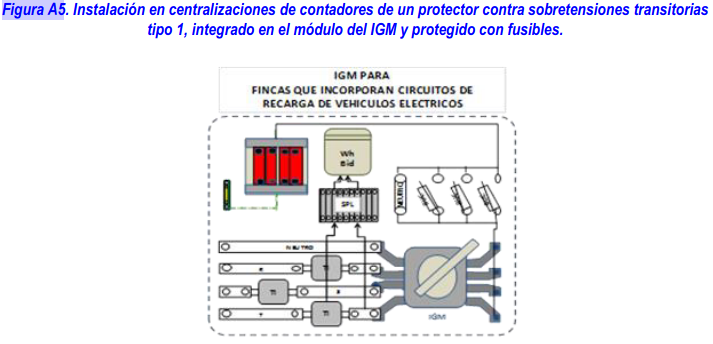

# 6. PROTECCIÓN PARA GARANTIZAR LA SEGURIDAD.

## 6.1 Medidas de protección contra contactos directos e indirectos.

Las medidas generales para la protección contra los contactos directos e indirectos serán las indicadas en la (ITC) BT-24 teniendo en cuenta lo indicado a continuación.

El  circuito  para  la  alimentación  de  las  estaciones  de  recarga    de  vehículos  eléctricos  deberá  disponer  siempre  de conductor de protección, y la instalación general deberá disponer de toma de tierra. 

En  este  tipode  instalaciones  se  admitirán  exclusivamente  las  medidas  establecidas  en  la  (ITC)  BT-24  contra contactos  directos  según  los  apartados  3.1,  protección  por  aislamiento  de  las  partes activas,  o  3.2,  protección  por medio de barreras o envolventes, así como las medidas protectoras contra contactos indirectos según los apartados 4.1, protección por corte automático de la alimentación, 4.2, protección por empleo de equipos de la clase II o por aislamiento equivalente, o 4.5, protección por separación eléctrica.  

Cualquiera  que  sea  el  esquema  utilizado,  la  protección  de  las  instalaciones  de  los  equipos  eléctricos  debe asegurarse   mediante   dispositivos   de   protección   diferencial.   Cada   punto   de   conexión   deberá   protegerse individualmente mediante un dispositivo de protección diferencial de corriente diferencial-residual asignada máxima de  30  mA,  que  podrá  formar  parte  de  la  instalación  fija  o  estar  dentro  del  SAVE.Con  objeto  de  garantizar  la selectividad  la  protección  diferencial  instalada  en  el  origen  del  circuito  derecarga  colectivo  será  selectiva  o retardada con la instalada aguas abajo.

Los dispositivos de protección diferencial serán de clase A. Los dispositivos de protección diferencial instalados en la vía pública estarán preparados para que se pueda instalar un dispositivo de rearme automático y los instalados en aparcamientos públicos o en estaciones de movilidad eléctrica dispondrán de un sistema de aviso de desconexión o estarán equipados con un dispositivo de rearme automático.

??? Warning

    Salvo cuando la proteccióncontra contactos indirectos se realiza por separación eléctrica, cada punto de conexión debe estar protegido mediante su propio diferencial que será como mínimo de tipo A, con una corriente diferencial residual no superior a 30 mA. Los dispositivos de protección diferencial deberían cumplir con una de las siguientes normas de producto: EN 61008-1, EN 61009-1, EN 60947-2 o EN 62423.
    
    Cuando  la  estación  de  carga  de  vehículos  eléctricos  esté  equipada  con  una  toma  de  corriente  o  un  conector  de vehículo  según  la  serie  de  Normas  EN  62196  (previstas  para  recarga  en  modo  3),  la  normalización  internacional más reciente (véase UNE-HD 60364-7-722) requiere de medidas contra las corrientes de fuga con componente en corriente  continua,  salvo  cuando  estas  medidas  estuvieran  incluidas  en  la  propia  estación  de  carga  de  vehículos eléctricos. Las medidas apropiadas, para cada punto de conexión pueden ser: 

    - Utilización de diferenciales de tipo B; o
    - Utilización de diferenciales de tipo A y un equipo que asegure la desconexión de la alimentación en caso de  corrientes  de  defecto  con  componente  en  continua  superior  a  los  6  mA  (dispositivo  de  detección  de corriente diferencial continua (RDC-DD)) conforme con la norma IEC 62955.

## 6.2 Medidas de protección en función delas influencias externas.

Las principales influencias externas a considerar en este tipo de instalaciones son:

-   Para  las  instalaciones  en  el  exterior:  penetración  de  cuerpos  sólidos  extraños,  penetración  de  agua,  corrosión  y resistencia a los rayos ultravioletas. 
-   Para  instalaciones  en  aparcamientos  o  estacionamientos  públicos,  privados  o  en  vía  pública:  competencia  de  las personas que utilicen el equipo. 
-   En todos los casos, el daño mecánico.
-   El proyectista deberá prestar especial atención a las influencias externas existentes en el emplazamiento en el que se ubique la instalación a fin de analizar la necesidad de elegir características superiores o adicionales a las que se prescriben en este apartado. 
-   Cuando la estación de recarga esté instalada en el exterior, los equipos deben garantizar una adecuada protección contra la corrosión. Para ello se tendrán en cuenta las prescripciones que se incluyen en la (ITC) BT 30.
-   Los  grados  de  protección  contra  la  penetración  de  cuerpos  sólidos  y  acceso  a  partespeligrosas,  contra  la penetración  del  agua  y  contra  impactos  mecánicos  de  las  estaciones  de  recarga  podrán  obtenerse  mediante  la utilización de envolventes múltiples proporcionando el grado de protección requerido el conjunto de las envolvente completamente montadas. En este caso, en la documentación del fabricante de la estación de recarga deberá estar perfectamente definido el método para la obtención de los diferentes grados de protección IP e IK. 

### 6.2.1 Grado de protección contra penetración de cuerpos sólidos y acceso a partes peligrosas.

Cuando  la  estación  de  recarga  esté  instalada  en  el  exterior  las  canalizaciones  deben  garantizar  una  protección mínima IP4X o IPXXD. 

Las  estaciones  de  recarga  y  otros  cuadros  eléctricos  tendrán  un  grado  de protección  mínimo  IP4X  o  IPXXD  para aquellas  instaladas  en  el  interior  e  IP5X  para  aquellas  instaladas  en  exterior.  El  grado  de  protección  especificado para la estación de recarga no aplica durante el proceso de recarga.

??? Warning
    El grado de protección establecidopara la estación de recarga no resulta extensible a la base de toma de corriente o conector tipo 2, siempre que exista un elemento de corteen la estación de carga que impida su alimentación cuando el  vehículo no  está  conectado. Por  este motivono es necesario  el  uso  de  obturadores  para  las  bases  de  toma  de corriente  o  conectores  tipo  2  o  Combo  2,  aunque  se  recomiendan  cuando se  prevea su  usopor  personal  no conocedor de los riesgos del manejo de la electricidad.

### 6.2.2 Grado de protección contra la penetración del agua. 
Cuando la estación de recarga esté instalada en el exterior, la instalación debe realizarse de acuerdo a lo indicado en el capítulo 2 de la (ITC) BT-30, garantizando, por tanto para las canalizaciones un IPX4. 

Las  estaciones  de  recargay  otros  cuadros  eléctricos  asociados  tendrán  un  grado  de  protección  mínimo  IPX4. Cuando la base de toma de corriente o el conector no cumpla con el grado IP anterior, éste deberá proporcionarlo la propia estación de recarga mediante su diseño. El grado deprotección especificado para la estación de recarga no aplica durante el proceso de recarga.

### 6.2.3 Grado de protección contra impactos mecánicos.
Los  equipos  instalados  en  emplazamientos  en  los  que  circulen  vehículos  eléctricos  deberán  protegerse  frentea daños mecánicos externos del tipo impacto de severidad elevada (AG3). La protección del equipo se garantizará a través de alguno de los medios siguientes:

- a)Emplazando  el  material  eléctrico  en  una  ubicación  en  la  que  éste  no  se  encuentre  sujeto  a  un  riesgo  de impacto previsible;
- b)Disponiendo  algún  tipo  de  protección  mecánica  adicional  en  aquellas  zonas  en  las  que  el  equipo  se encuentre sujeto al riesgo de impacto;
- c)Seleccionando el material eléctrico con un grado de protección contra daños mecánicos de acuerdo con lo especificado en los apartados 6.2.3.1 y 6.2.3.2;
- d)Usando la combinación de alguna o todas las medidas anteriores.

#### 6.2.3.1. Grado de protección de las envolventes.
Cuando  la  protección  del  equipo  eléctrico  frente  a  daños  mecánicos  se  garantice  mediante  envolventes,  una  vez instaladas deberán proporcionar un grado de protección mínimo IK08 contra impactos mecánicos externos. 

El  cuerpo  de  las  estaciones  de  recarga  y  otros  cuadros  eléctricos  ubicados  en  el  exterior  tendrán  un  grado  de protección mínimo  contra  impactos  mecánicos  externos  de  IK10.  El  cuerpo  de  las  estaciones  de  recarga  excluye partes  tales  como  teclado,  leds,  pantallas  o  rejillas  de  ventilación.  El  grado  de  protección  especificado  para  la estación de recarga no aplica durante el proceso de recarga.

#### 6.2.3.2 .Grado de protección de las canalizaciones.

Cuando las canalizaciones se instalen en una ubicación sujeta a riesgo de daños mecánicos, tales como áreas de circulación  de  vehículos  eléctricos,  éstas  presentarán  una  resistencia  adecuada  a  los  daños  mecánicos.  En  estos casos, los tubos presentarán una resistencia mínima al impacto grado 4 y una resistencia mínima a la compresión grado 5. Si se utilizan canales protectoras, éstas presentarán una resistencia mínima IK08 a impactos mecánicos.

En  otros  sistemas  de  conducción  que  no  aporten  protección  mecánica  a  los  cables,  la  protección  se  garantizará mediante el uso de medios mecánicos adicionales, por ejemplo mediante la utilización de cables armados.

??? Warning

    Cuando  el  proyectista considere  que  existe  un  riesgo importante de choquede  los vehículos contralacanalización ésta deberá tener una mayor resistencia al impacto

    - En el caso de tubos, resistencia mínima al impacto grado 5 según UNE-EN 61386.
    - En el caso de canales, resistencia al impactode 20 J según UNE-EN 50085

## 6.3 Medidas de protección contra sobreintensidades

Los  circuitos  de  recarga,  hasta  el  punto  de  conexión,  deberán  protegerse  contra  sobrecargas  y cortocircuitos  con dispositivos de corte omnipolar, curva C, dimensionados de acuerdo con los requisitos de la (ITC) BT 22. 

Cada punto de conexión deberá protegerse individualmente. Esta protección podrá formar parte de la instalación fija o estar dentro del SAVE. 

En instalaciones previstas para modo de carga 1 ó 2 en las que el punto de recarga esté constituido por tomas de corriente  conformes  con  la  norma  UNE  20315,  el  interruptor  automático  que  protege  cada  toma  deberá  tener  una intensidad  asignada  máxima  de  10  A,  aunque  se  podrá  utilizar  una  intensidad  asignada  de  16  A,  siempreque  el fabricante  de  la  base  garantice  que  queda  protegida  por  este  interruptor  automático  en  las  condiciones  de funcionamiento  previstas  para  la  recarga  lenta  del  VEHÍCULO  ELÉCTRICO  con  recargas  diarias  de  8  horas,  a  la intensidad de 16A.

En las instalaciones previstas para modo de carga 3 la selección  del interruptor automático que protege el circuito que  alimenta  la  estación  de  recarga  garantizará  la  correcta  protección  del  circuito,  evitando  al  mismo  tiempo  el disparo  intempestivo  de  la  protección  durante  el  proceso  de  recarga.  Para  su  selección  se  puede  utilizar  como referencia la documentación del fabricante de la estación. La tolerancia de la señal correspondiente a la intensidad de  carga,  el  consumo  interno  de  la  propia  estación  de  recarga  y  las condiciones  ambientales  de  instalación, justifican  que  la  intensidad  asignada  del  interruptor  automático  sea  en  algunos  casos  superior  a  la  suma  de intensidades asignadas que pueden suministrar los puntos de conexión de la estación de recarga.

## 6.4 Medidasde protección contra sobretensiones.
Todos  los  circuitos  deben  estar  protegidos  contra  sobretensiones  temporales  y  transitorias.  Los  dispositivos  de protección contra  sobretensiones  temporales  estarán  previstos  para  una  máxima  sobretensión  entre fase y  neutro hasta  440V.  Los  dispositivos  de  protección  contra  sobretensiones  temporales  deben  ser  adecuados  a  la  máxima sobretensión entre fase y neutro prevista.

??? Warning

    En  el  caso  en  que  la  máxima  sobretensión  prevista  entre  fase  y  neutro  sea  440V  los  dispositivos contra sobretensiones  temporales  deben  cumplir  con  la  Norma  UNE-EN  50550.El  dispositivo  de  protección  contra sobretensiones  temporales  puede  instalarse  en  el  circuito  de  recarga,  junto  a  la  estación  de  recarga  o  dentro  de ella.

Los  dispositivos  de  protección  contra  sobretensiones  transitorias deben  ser  instalados en  la  proximidad  del  origen de la instalación o en el cuadro principal de mando y protección, lo más cerca posible del origen de la instalación eléctrica en el edificio. Según cuál sea la distancia entre la estación de recarga y el dispositivo de protección contra sobretensiones transitorias situado aguas arriba, puede ser necesario proyectar la instalación con un dispositivo de protección  contra  sobretensiones  transitorias  adicional  junto  a  la  estación  de  recarga.  En  este  caso,  los  dos dispositivos de protección contra sobretensiones transitorias deberán estar coordinados entre sí.

Con  el  fin  de  optimizar  la  continuidad  de  servicio  en  caso  de  destrucción  del  dispositivo  de  protección  contra sobretensiones transitorias a causa de una descarga de rayo de intensidad superior a la máxima prevista, cuando el dispositivo  de  protección  contra  sobretensiones  no  lleve  incorporada  su  propia  protección,  se  debe  instalar  el dispositivo  de  protección  recomendado  por  el  fabricante,  aguas  arriba  del  dispositivo  de  protección  contra sobretensiones,  con  objeto  de  mantener  la  continuidad  de  todo  el  sistema,  evitando  así  el  disparo  del  interruptor general.

??? Warning

    Se  recomienda  instalar  una protección  contra  sobretensiones  transitorias  de tipo  1aguas  arriba  del  contador principal, instalando  dicho  protector  bien  en  la  caja  de  protección  y  medida,  CPM,en  el  caso  de  suministros individuales,  o  bienjunto  al  interruptor  general  de  maniobra,  IGM,situado  a  la  entrada  de  la  centralización  de contadores. En la figura A5 se representa, a modo de ejemplo, la instalación de un protector contra sobretensiones transitorias tipo 1, integrado en el módulo del IGM y protegido mediante fusibles. 

    

    Según  la  norma  UNE-CLC/TS  61643-12  "Dispositivos  de  protección  contra  sobretensiones  transitorias  de  baja tensión. Parte 12: Dispositivos de protección contra sobretensiones transitorias conectados a sistemas eléctricos de baja tensión. Selección y principios de aplicación", cuando la distancia entre la estación de recarga y el dispositivo de  protección  contra  sobretensionestransitorias  situado  aguas  arriba  seasuperior o  igual  a  10  metros  es recomendable  instalar  un  dispositivo  adicional  de  protección  contra  sobretensiones  transitorias,  tipo  2,  junto  a  la estación de recarga o dentro de ella.

