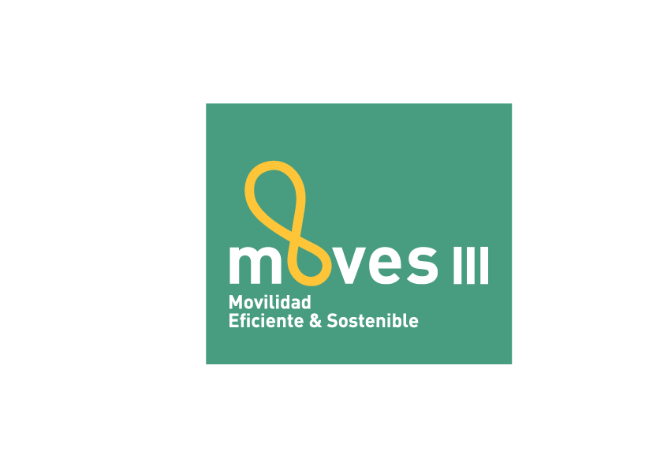

#

???+  "20220629.-Programa MOVES III"
    <a href="MOVESIII/1._Como_puedo_instalar_un_punto_de_recarga/"><figure>
    
    <figcaption> Los electrodomésticos y las etiquetas de eficiencia energética tienen una cosa muy importante en común: nos hacen la vida más fácil. ...'
    </figcaption>
    </figure></a>

???+  "20220610.- ITC-BT 52 'Instalaciones con fines especiales. Infraestructura para la recarga de vehículos eléctricos'"
    <a href="ITC-BT_52/1._OBJETO_Y_AMBITO_DE_APLICACION/"><figure>
    
    <figcaption> ITC-BT 52 'Instalaciones con fines especiales. Infraestructura para la recarga de vehículos eléctricos'
    </figcaption>
    </figure></a>

