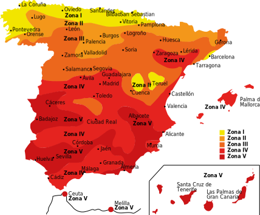

# 

???+ Resumen

    === "Enlaces"
        [(ITC) BT 52 "Instalaciones con fines especiales. Infraestructura para la recarga de vehículos eléctricos"](https://www.boe.es/buscar/doc.php?id=BOE-A-2014-13681)

    === "Tecnico"

        [Guía técnica de aplicación de la ITC-BT 52. INSTALACIONES CON FINES ESPECIALES: INFRAESTRUCTURA PARA LA RECARGA DE VEHÍCULOS ELÉCTRICOS](./assets/guia_bt_52_nov17R1.pdf){ .md-button }

        [Submit ](#){ .md-button .md-button--primary }

        { align=left }
     
??? example

    === "Proyectos"

        [Instalación Eléctricade unEdificio destinado aViviendas](./assets/EJEMPLO PROYECTO VIVIENDAS.pdf)

        [Proyecto de instalación eléctrica de un edificio de 26 viviendas, locales comerciales y garaje, situado en el término municipal de Llombai.](./assets/Proyecto de Instalacion Electrica de un edificio de 26 viviendas.pdf)

        [PROYECTO DE LAS INSTALACIÓNES DEELECTRICIDAD, VENTILACIÓN   Y   INCENDIOSEN   UN   BLOQUE   DE   VIVIENDAS SITUADO EN BERGARA.](./assets/PROYECTO INSTALACIONES GARAJE.pdf)

    === "RESUMEN"

        [TARIFAS](./assets/TARIFAS VE.pdf)

        [ITC 52 RESUMEN](./assets/ITC 52 RESUMEN.pdf)
        
        
        
    === "fabricantes"
        [mercantilelectrico](https://www.mercantilelectrico.com/cargadores-de-coches-electricos.html)

        [circutor:](http://circutor.es/es/productos/recarga-inteligente-para-vehiculos-electricos/manufacturer/?categorylayout=0&showcategory=1&showproducts=1&productsublayout=0)
        
        [schneider:](https://www.se.com/es/es/product-category/1800-carga-veh%C3%ADculo-el%C3%A9ctrico/?filter=business-4-distribuci%C3%B3n-el%C3%A9ctrica-en-baja-tensi%C3%B3n)
        
        [Simon:](https://www.simonelectric.com/recarga-de-vehiculos-electricos)

        Centralizacion contaores. Medida LGA

        [pinazo](https://pinazo.com/recarga-vehiculos-electricos)
        [mercantilelectrico](https://www.mercantilelectrico.com/transformadores-de-intensidad.html&numart=18&orden=precio&offset=1)

        sw
        
        [-control-dinamico-de-carga](https://www.lugenergy.com/el-control-dinamico-de-carga-en-los-nuevos-puntos-de-recarga-para-vehiculos-electricos/)
        [circutor](http://docs.circutor.com/docs/M121B01-01.pdf)

